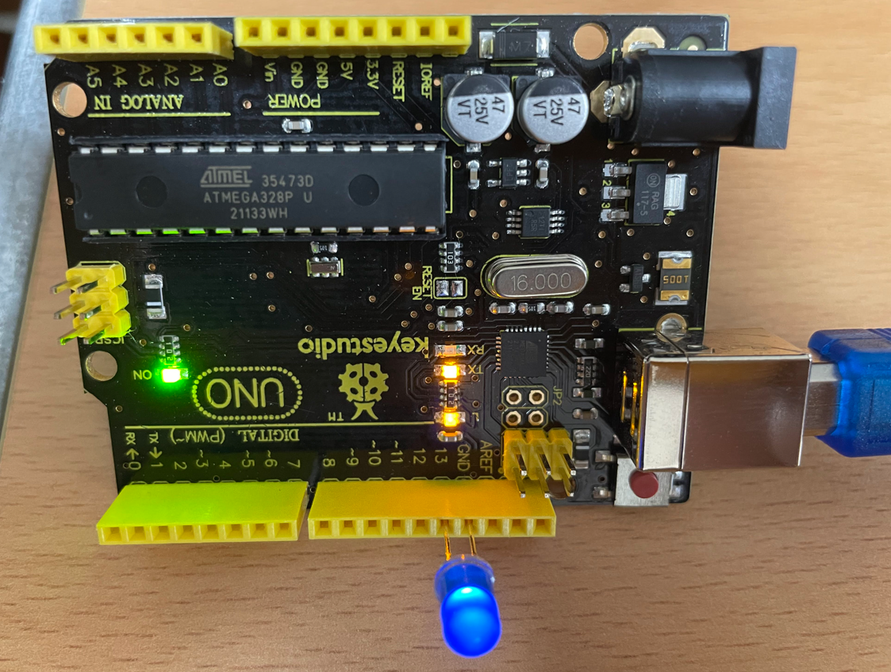
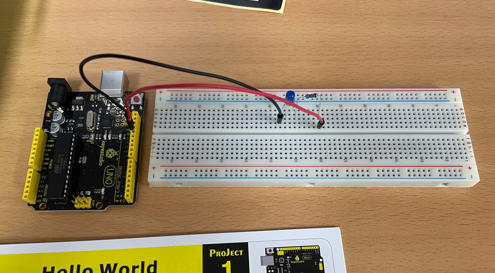
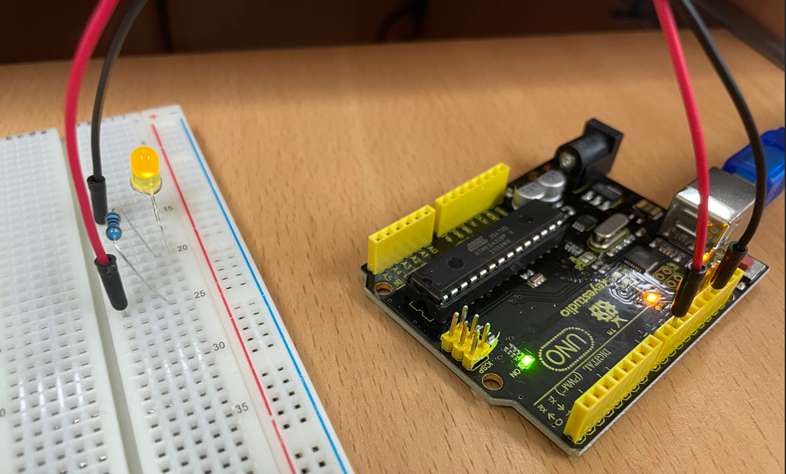
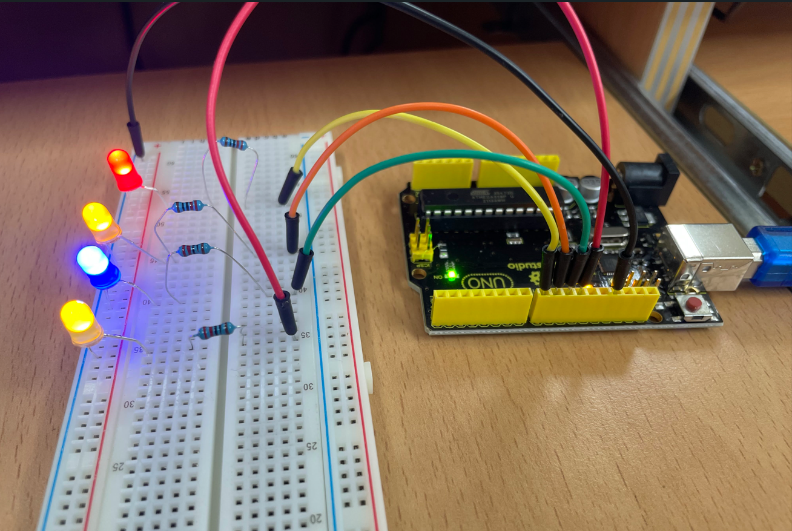
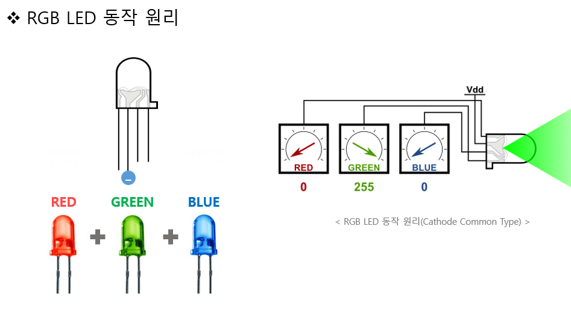

## LED 깜박임 디지털 출력
LED를 아두이노 보드에 다이렉트에 연결할 수 있는 이유는 LED에 이미 저항이 연결되어 있어서 저항 없이 회로를 구성해도 문제가 되지 않습니다.
- LED 설명
    - LED는 다리가 긴 쪽이 (+)
    - 다리가 짧은 쪽은 (-)
- LED 연결
    - LED 다리가 긴 쪽을 우노보드 13에 연결 합니다.
    - LED 다리가 짧은쪽을 우노보드 GND에 연결 합니다.
    - LED 다리가 짧은쪽을 우노보드 GND에 연결 합니다.

```c
void setup() {
  // put your setup code here, to run once:
  // SETUP 함수는 보드에 전원 공급 또는 리셋 버튼을 눌렀을때 한번 실행됩니다.
  
  pinMode(13,OUTPUT); // 13번 디지털 핀을 출력으로 설정
}

void loop() {
  // put your main code here, to run repeatedly:
  // loop 함수는 전원이 켜저 있는 동안 무한 반복후 실행됩니다.

  
  digitalWrite(13,HIGH); //번 핀에 high 설정 . LED
  delay(100); // ms 단위. 대기시간지연  
  
  digitalWrite(13,LOW);
  delay(1500); // 딜레이 함수를 한번 더 적용합니다.  
}
```

  

  


## 점점 밝아지고 점점 어두워지는 led 출력  

  

```c

int ledPin = 9; // 9번 핀에 led 연결
void setup() {
}

void loop() {
  
   //fadeValue 변수를 선언하고 최소값에서 최대값까지 5씩 늘린다.
   for(int fadeValue = 0; fadeValue <= 255; fadeValue += 5){
   analogWrite(ledPin, fadeValue); 
   delay(30); //30ms 대기 
   };

   //fadeValue 변수를 선언하고 최소값에서 최대값까지 5씩 줄인다.
   for(int fadeValue=255;fadeValue>=0;fadeValue -= 5){
   analogWrite(ledPin, fadeValue);    
   delay(30); //30ms 대기 
  };
  
 
}


```


[영상보기-클릭](https://youtube.com/shorts/H3ccrY8EObs?feature=share)

## 여러개의 led전구를 fadeOn과 fadeOff의 형식으로 출력하기

[영상보기_클릭_여러개전구](https://youtu.be/Gt8zVnluAA8)  
[영상보기_클릭_여러개전구_fade](https://youtu.be/pSKfEgj29qc)


  

```
int led_pin[4] = {8,9,10,11};

void setup() {
  // put your setup code here, to run once:
  for (int i = 0; i<4; i++){
    pinMode(led_pin[i], OUTPUT);
  }

}

void loop() 
{
  // put your main code here, to run repeatedly:
  for (int i = 0; i<4; i++){
     for(int fadeValue = 0; fadeValue <= 255; fadeValue += 5){
           analogWrite(led_pin[i], fadeValue); 
           delay(30); //30ms 대기 
       }
       delay(50);
  }      
  
  for (int i = 3; i >= 0; i--)
  {
      for(int fadeValue=255;fadeValue>=0;fadeValue -= 5)
      {
         analogWrite(led_pin[i], fadeValue);    
         delay(30); //30ms 대기     delay(500);
      }    
      delay(50);
  }
}
```

- 위 코드의 함수화 및 리팩토링.
```c
int led_pin[4] = {8,9,10,11};

void fadeOn(int led_pin)
{
  for(int fadeValue = 0; fadeValue <= 255; fadeValue += 5){
           analogWrite(led_pin, fadeValue); 
           delay(30); //30ms 대기 
       }
}
void fadeOff(int led_pin)
{
  for(int fadeValue=255;fadeValue>=0;fadeValue -= 5)
      {
         analogWrite(led_pin, fadeValue);    
         delay(30); //30ms 대기     delay(500);
      }
}

void setup() {
  // put your setup code here, to run once:
  for (int i = 0; i<4; i++){
    pinMode(led_pin[i], OUTPUT);
  }

}


//실행부
void loop() 
{
  // put your main code here, to run repeatedly:
  for (int i = 0; i<4; i++){
     fadeOn(led_pin[i]);
     delay(50);
  }      
  
  for (int i = 3; i >= 0; i--)
  {
      fadeOff(led_pin[i]);
      delay(50);
  }
}
```
## RGB LED 제어하기
빨간색, 초록색, 파란색 세 종류의 색을 이요해, 0~255 범위의 analogWrite 함수의 인자 값을 조절해 다양한 색을 표현 할 수있습니다.



rgb 기본 코드 설정.

```c++
int redPin = 6;
int greenPin = 5;
int bluePin = 3;
int redOff,greenOff,blueOff;

void setup() {

}

void loop() {
  analogWrite (redPin, 255);
  delay(1000);
  analogWrite (redPin, redOff);
  delay(1000);
  analogWrite (greenPin, greenOff);
  delay(1000);
  analogWrite (bluePin, 255);
  delay(1000);
  analogWrite (bluePin, blueOff);  

}

```

```C++
int redPin = 6;
int greenPin = 5;
int bluePin = 3;
int redOff,greenOff,blueOff; // 쓰레기값으로 인식하여 0 으로 받아들임.

void setup() {

}

void loop() {
  analogWrite (redPin, 112);  
  analogWrite (bluePin, 128);
  analogWrite (redPin, 144);
  delay(1000);   
  analogWrite (redPin, 0);  
  analogWrite (bluePin, 0);
  analogWrite (redPin, 0);  
  delay(1000);  
  analogWrite (redPin, 184);  
  analogWrite (bluePin, 134);
  analogWrite (redPin, 11);
  delay(1000);   
  analogWrite (redPin, redOff);  
  analogWrite (bluePin, redOff);
  analogWrite (redPin, redOff);  
  delay(1000);

}
```