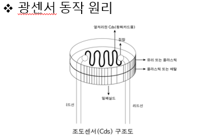
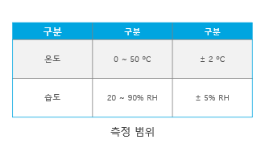
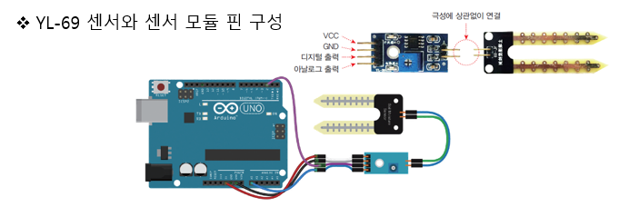
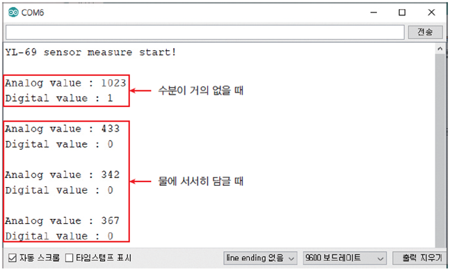
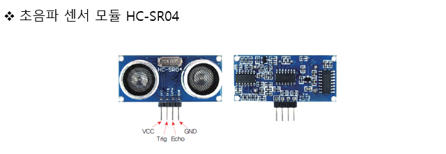
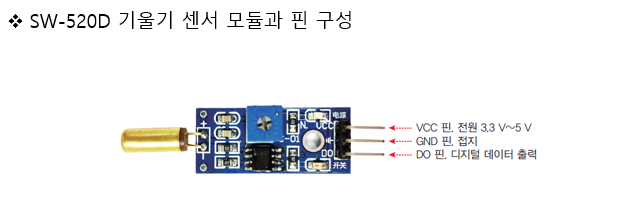

## 센서의 종류

- 피에조 부저
- 광센서
- 온도센서
- 온도,습도 센서
- 토양 수분 센서
- 초음파 센서
- 기울기 센서
- 적외선 센서
- 아날로그 조이스틱
- 3축 가속도 센서

## 피에조 부저

4옥타브의 라(A) 는 음의 기준입니다. 라의 주파수는 440hz 이고 이것을 기준으로 한 옥타브가 높아질경우 주파수가 두배가 되며 한 옥타브가 낮아질 경우 주파수는 반으로 줄게 됩니다.

- 주파수의 계산식
 - (Hz) = 1/sec(주기)
 - (sec) = 1/Hz(주파수)


## 광센서

광센서의 동작원리는 빛을 받으면 그 에너지의 영향으로 내부의 자유 전자가 발생, 전도율이 변하는 광전효과를 가진 소자로 구성되어 있습니다. 황화카드뮴(Cds)을 소자로 사용하는 경우, 
Cds 센서라고 부르기도 합니다.



조도 센서는 빛의 양에 따라 전도율이 변합니다. 빛의 양이 많아질수록 전도율이 증가해 저항이 감소하고, 빛의 양이 적어질 수록 전도율이 감소해 저항이 증가하는 원리입니다.


```c++
  int tmpPin = A0; 	// 온도 센서 신호 출력 핀. 아두이노 보드 A0에 연결

void setup()
{
   Serial.begin (9600);
   Serial.println (“start measure of temperature”);
}

void loop()
{
   int tempValue = analogRead (tmpPin);
   float tempVolt = tempValue * 5.0 / 1024.0;
   float celsiusTemp = (tempVolt - 0.5) * 100;
   float fahrenheitTemp = (celsiusTemp * 9.0 / 5.0) + 32.0;

   Serial.print (“Celsius : “);
   Serial.println (celsiusTemp);

   Serial.print (“Fahrenheit : “);
   Serial.println (fahrenheitTemp);
   Serial.println ();
   delay (3000);
}
```

## 온습도 센서(온도,습도)
온도 습도 센서는 주변 환경의 온도와 습도를 측정하는 센서입니다. 주변 환겨으이 온도와 습도에 따른 저항치 변화로 온도 습도 수치를 측정할 수 있습니다. 온도 습도 센서를 이용해서 시간이 지남에 따라 사용이 가능합니다.
보일러 에어컨 등 실생활에서 다양하게 사용되고 있습니다. 또한 농업에서도 온습도의 변화, 지역에 따른 온습도 비교, 불쾌지수 파악 등 다양하게 활용 되고 있습니다.


온습도 센서는 온도를 측정하기 위한 소자들로 구성이 됩니다. 
서미스터라고 하는 반도체를 사용하며, 이 소자는 온도에 따라서 저항이 변하는 특성을 가지고 있습니다. 
습도를 측정하기 위해 저항형 습도 센서를 사용하며, 이 소자도 마찬가지로 습도에 따라 저항이 변하는 특성을 가지고 있습니다.



```c++
#include <DHT.h>
#define DHTPIN 2
DHT dht (DHTPIN, DHT11);

void setup()
{
  Serial.begin (9600);
  Serial.println ("DHT11 measure start!");
  Serial.println();
  dht.begin ();
}

void loop()
{
  float humivalue = dht.readHumidity ();
  float tempvalue = dht.readTemperature();

  if (isnan (humivalue) || isnan (tempvalue))
  {
    Serial.print("fail to read from dht sensor!");
  }

  Serial.print ("Humidity : ");
  Serial.print (humivalue);
  Serial.println ("%RH");

  Serial.print ("Temperature : ");
  Serial.print (tempvalue);
  Serial.println ("C");
  Serial.println ();

  delay (2000);
  
}
```

## 토양 수분 센서



토양 수분 센서는 토양 내 수분 함량에 따른 저항의 변화를 측정하는 센서로 토양 내 수분과 토양을 구성하는 입자의 크기 및 다양성에 영향을 받는다.
토양 내 수분 함량이 많으면 저항값이 작아지고 수분 함량이 부족하면 저항값이 커진다.

토양 센서를 연결하고 수분이 일정량 들어오는 경우 led가 켜지도록 설정.
```c++
int ledPin = 13; 	// 아두이노 보드 13번 LED 연결
int soilsensorPinA = A0; 	// 아날로그 출력 핀(AO). A0 핀에 연결
int soilsensorPinD = 2;  	// 디지털 출력 핀(DO). 2번 핀에 연결

void setup()
{
   pinMode (ledPin, OUTPUT); 	// 13번 핀 출력으로 설정
   pinMode (soilsensorPinD, INPUT);  // 2번 핀 입력으로 설정

   Serial.begin (9600);
   Serial.println (“YL-69 sensor measure start!”);
   Serial.println ();
}

void loop()
{
   int analogValue = analogRead (soilsensorPinA);
   int digitalValue = digitalRead (soilsensorPinD);

   if (analogValue > 800)
   {
      digitalWrite (ledPin, HIGH);
   }
   else
   {
      digitalWrite (ledPin, LOW);
   }

   Serial.print (“Analog value : “);
   Serial.println (analogValue);

   Serial.print (“Digital value : “);
   Serial.println (digitalValue);
   Serial.println ();

   delay (2000);
}

```



## 초음파 센서
초음파 센서는 초음파가 가지고 있는 파장의 분해능과 반사 특성을 이용하여 거리나 두께,움직임, 농도 등을 검출하는 센서 입니다.



## 기울기 센서
기울기 센서의 전압이 설정된 기준 전압보다 낮으면 센서 내의 비교기를 통해 LOW 신호를 출력하고 기울기가 없으면 비교기를 통해 HIGH 신호를 출력 합니다. 
모듈 형태의 센서류를 사용할 경우 비교기를 포함하고 있는 경우가 많으며 가변 저항을 통해 센서의 민감도를 조정할 수습니다.

