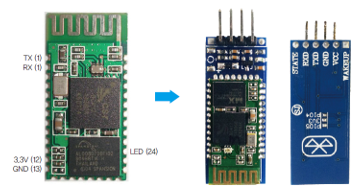

## 소프트웨어 시리얼 통신이란?

- 오렌지 보드(아두이노 우노)에서 사용하는 일반 시리얼 통신은 0번(RX), 1번(TX)핀에 연결되어 있는 하드웨어 시리얼 포트를 이용합니다.
- 시리얼 통신은 1대 1통신으로 한번에 하나의 통신만이 가능합니다. 오렌지보드는 이미 USB케이블을 통해서 컴퓨터와 연결되어 1대 1통신을 하고있습니다.
- 오렌지보드 에서는 이런 상태에서 다른 시리얼 통신을 하기 위해 SoftwareSerial 이라는 기본 라이브러리를 제공해 다른 디지털 핀에서 시리얼 통신을 할 수 있도록 지원합니다.
- 기본적으로 오렌지보드 에서는 모든 핀 에서 소프트웨어 시리얼 통신을 사용 할 수 있지만, 다른보드(예:메가,레오나르도)에서는 소프트웨어 시리얼을 지정하는 핀이 정해져 있습니다.

*소프트웨어 시리얼은 무한정 늘려서 사용하는 것이 아니라 한 번에 하나의 시리얼 통신만을 추가졸 사용할 수 있습니다. 일반 Serial 클래스의 멤버 함수의 이름과 기능이 비슷합니다.

