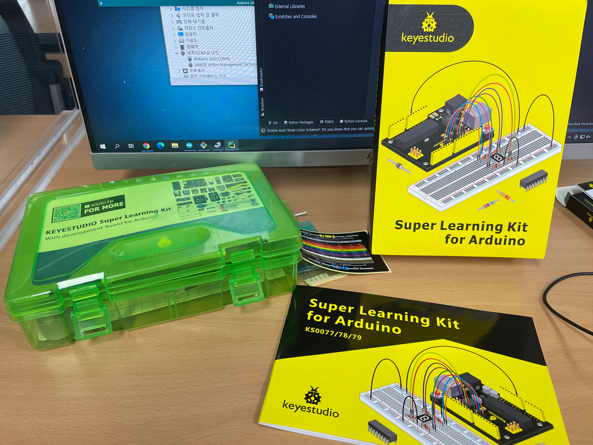
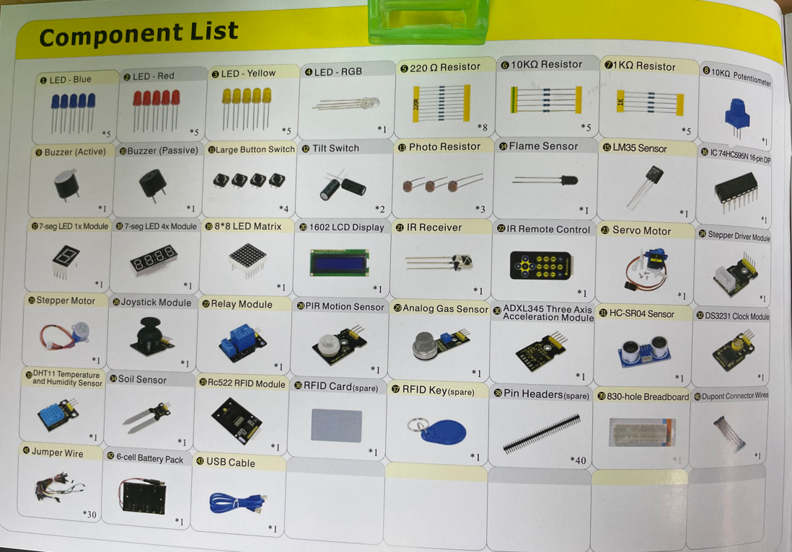
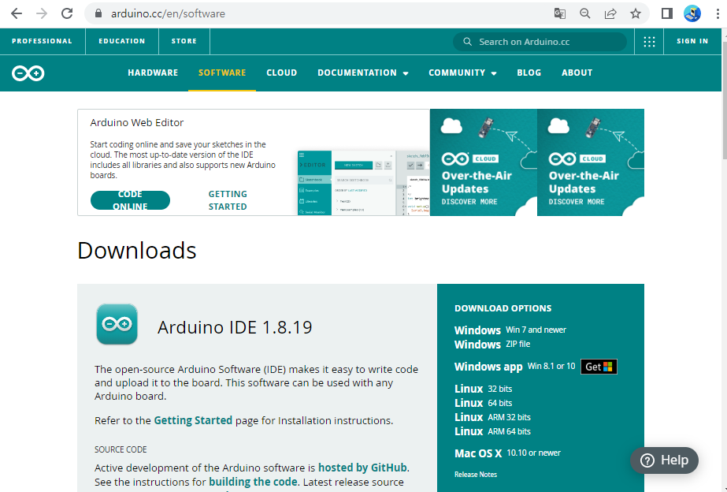
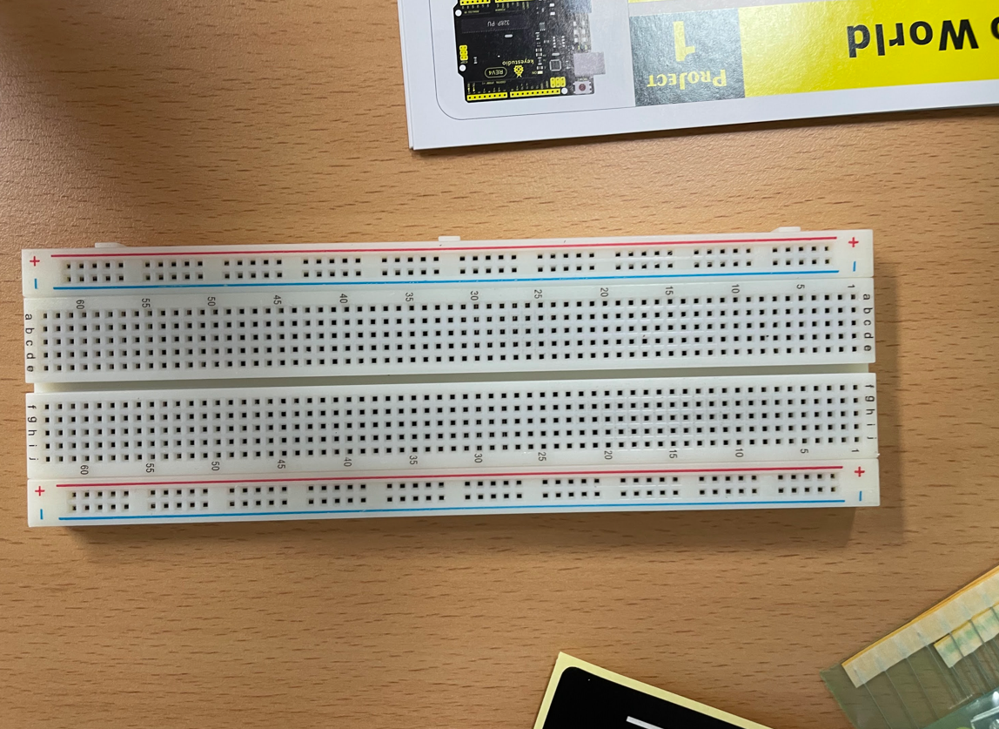

## 아두이노 킷.

## 아두이노 설치.

[아두이노 설치 링크](https://www.arduino.cc/)

  

전용 os 에 맞춰 다운로드 합니다.

  

설치 후 실행한 아두이노 ide 개발 툴의 모습.

## 전기와 전자.
옴의 법칙.
전선과 같은 도체를 통해 전류가 흐를 때 전류의 흐름을 방해 하는 것을 저항이라고 하며, 옴이라는 단위를 사용합니다.
전선의 재질과 굵기, 길이에 따라서 저항 값이 달라집니다.'

- V = IR
- I = V/R
- R = V/I

## 브레드 보드의 구조.

빵판 이라고도 하며, 전류의 흐름을 도와 줌으로써 아두이노의 명령을 통해 결과 값을 출력하거나 모니터링등 센서를 이용 할 수 있습니다.
우노보드에도 직접적으로 연결할 수있지만 브레드 보드를 통해 전류의 흐름을 확장 시킬수 있습니다.

1. (+)빨간색이 선이 위로 할수 있게 하여 정방향으로한다.
2. (-)빨간색 가로구멍 전체가 연결되어있다.
3. 파란색 구멍 전체가 연결되어 있다.
4. 초록색 구멍 5개가 연결되어 있다. 이 5개는 세로로 연결이 가능하다.
5. 가운데를 기준으로 위 아래는 서로 다른 구간이다.

## 기본 명령

### 순차구조란?
void setup()
setup은 최초 한번 만 실행

void loop()
loop는 무한반복 실행.

### 기본 함수 개념.
- pinMode : pinMode(사용할 핀의 모드,input또는output)
  - 핀의 상태를 입력 또는 출력으로 설정합니다. 디지털 입/출력시 사용.
- digitalWrite(사용할 핀의 번호, on(HIGH,1) 또는 off(low,0))
- delay(대기할 시간(밀리초 / ms단위)) : 입력한 시간만큼의 대기.

### PWM
Pulse Width Modulation 의 준말로 펄스의 폭을 컨트롤 하는 주기 제어방법 이라고 합니다.
출력되는 전압값을 일정한 비율동안 HIGH를 유지하고, 나머지는 LOW를 출력해 사각파의 출력을 마들어 내는데, PWM을 사용하면 0V  와 5V 사이의 아날로그 값을 모사할 수도 있고, 제어 나 통신에서도 많이 사용합니다.

