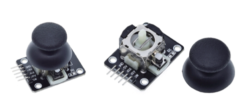
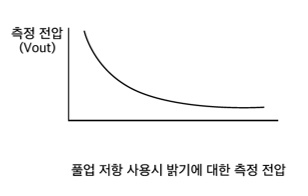

## 아두이노 개발 환경

### 아두이노 킷.




### 아두이노 설치.

[아두이노 설치 링크](https://www.arduino.cc/)


전용 os 에 맞춰 다운로드 합니다.


설치 후 실행한 아두이노 ide 개발 툴의 모습.

### 전기와 전자.
옴의 법칙.
전선과 같은 도체를 통해 전류가 흐를 때 전류의 흐름을 방해 하는 것을 저항이라고 하며, 옴이라는 단위를 사용합니다.
전선의 재질과 굵기, 길이에 따라서 저항 값이 달라집니다.

- V = IR
- I = V/R
- R = V/I

### 브레드 보드의 구조.



빵판 이라고도 하며, 전류의 흐름을 도와 줌으로써 아두이노의 명령을 통해 결과 값을 출력하거나 모니터링등 센서를 이용 할 수 있습니다.
우노보드에도 직접적으로 연결할 수있지만 브레드 보드를 통해 전류의 흐름을 확장 시킬수 있습니다.

1. (+)빨간색이 선이 위로 할수 있게 하여 정방향으로한다.
2. (-)빨간색 가로구멍 전체가 연결되어있다.
3. 파란색 구멍 전체가 연결되어 있다.
4. 초록색 구멍 5개가 연결되어 있다. 이 5개는 세로로 연결이 가능하다.
5. 가운데를 기준으로 위 아래는 서로 다른 구간이다.

### 아두이노 출력
1. LED 깜박임 예제를 통해 디지털 출력
LED를 아두이노 보드에 다이렉트에 연결할 수 있는 이유는 LED에 이미 저항이 연결되어 있어서 저항 없이 회로를 구성해도 문제가 되지 않습니다.
   - LED 설명
     - LED는 다리가 긴 쪽이 (+)
     - 다리가 짧은 쪽은 (-)
   - LED 연결
     - LED 다리가 긴 쪽을 우노보드 13에 연결 합니다.
     - LED 다리가 짧은쪽을 우노보드 GND에 연결 합니다.
     - LED 다리가 짧은쪽을 우노보드 GND에 연결 합니다.

```c
void setup() {
  // put your setup code here, to run once:
  // SETUP 함수는 보드에 전원 공급 또는 리셋 버튼을 눌렀을때 한번 실행됩니다.
  
  pinMode(13,OUTPUT); // 13번 디지털 핀을 출력으로 설정
}

void loop() {
  // put your main code here, to run repeatedly:
  // loop 함수는 전원이 켜저 있는 동안 무한 반복휴ㅐ서 실행됩니다.

  
  digitalWrite(13,HIGH); //번 핀에 high 설정 . LED
  delay(100); // ms 단위. 대기시간지연  
  
  digitalWrite(13,LOW);
  delay(1500); // 딜레이 함수를 한번 더 적용합니다.  
}
```


2. PWM을 이용한 LED 밝기 제어.


