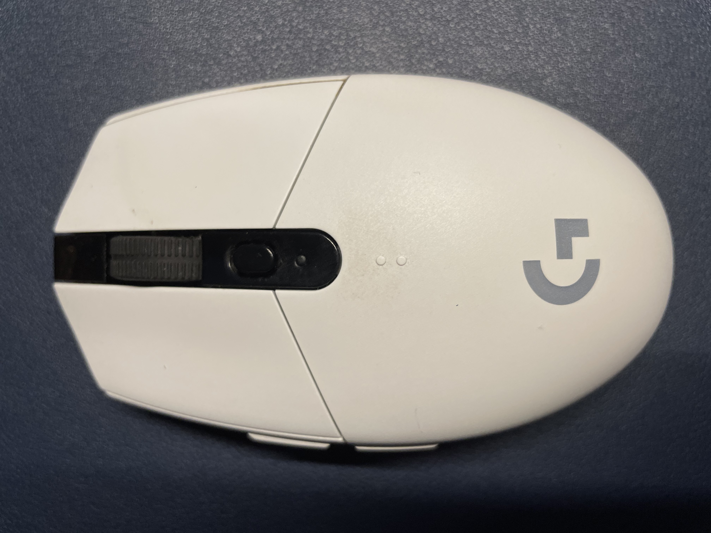
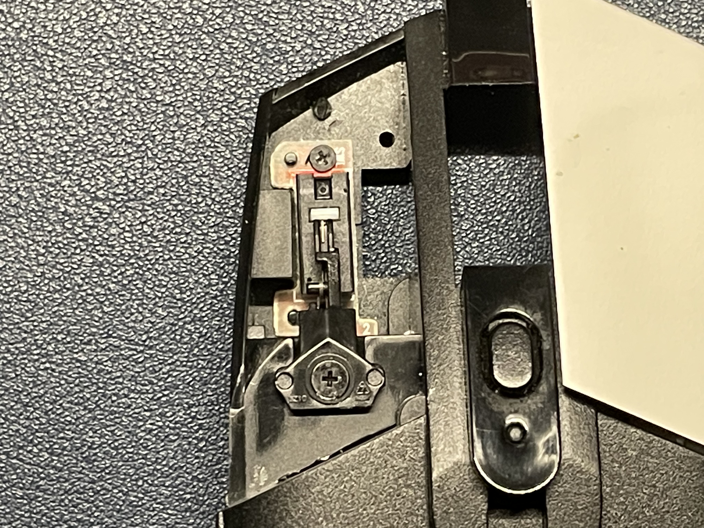
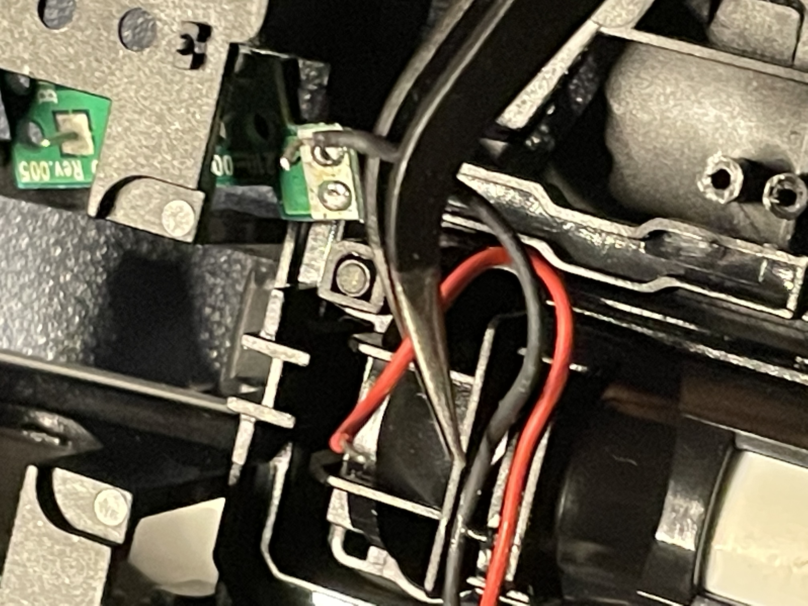
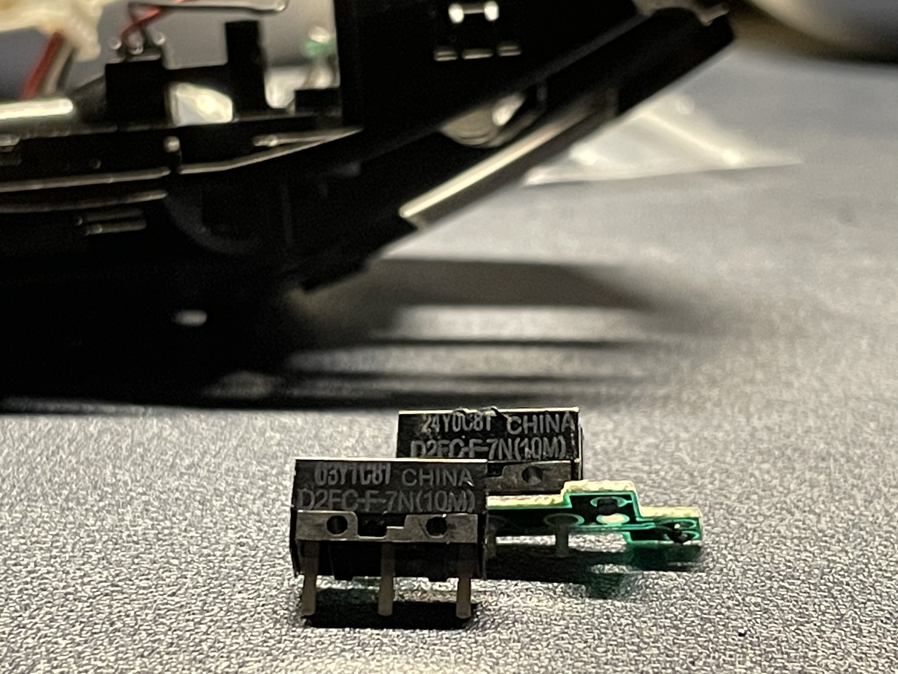
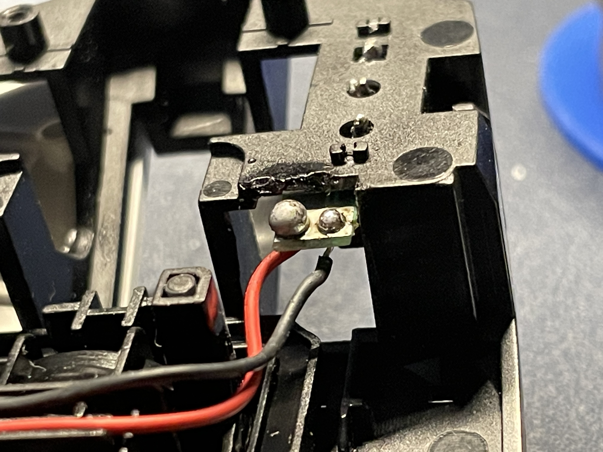

# 로지텍 마우스 수리

이 포스팅은 수리를 어떻게 했는지에 대한 과정을 담았습니다.    

## 나의 마우스 수리기

저는 게이밍 전용 무선마우스 G304를 쓰고 있습니다.
그러나 수리를 위한 로지텍 마우스 클릭부품은 대부분 같은 부품을 사용하거나 다르더라도 감도만 달라 인터넷쇼핑몰에서 쉽게 구할 수 있습니다.  

  

로지텍 마우스의 사용은 크게 만족하며 사용하고 있습니다.  
그러나 경험에 의하면 대부분의 사용기간이 1년이상을 경과하는 경우 마우스의 클릭내구성이 떨어지는 것을 느낍니다.

  

대표적인 예로 클릭시 더블클릭이 된다거나,클릭이 되지 않거나 하는 부분들은 클릭할 때에 부품에 내구성이 다 된것이거나, 이물질 등이 끼여 클릭이 잘 안될 수 있습니다.
시간의 핑계로 매일 미루다가 오늘 직접 수리하게 되었습니다.

## 마우스 수리 준비물
본격적으로 마우스를 직접 수리하기 위해 몇가지 준비물이 필요합니다.   

마우스의 수리를 위한 최소한의 준비물은 아래와 같습니다.
- 클릭 부품
- 인두기 세트(납 포함)
- 전자기기용 드라이버 세트

클릭부품은 알리익스프레스 에서 로지텍 클릭 부품을 검색 하시면 나옵니다.

혹은 제가 구매하였던 링크를 남겨놓도록 하겠습니다.

[클릭 부품 링크](https://ko.aliexpress.com/item/4001029436518.html?srcSns=sns_KakaoTalk&spreadType=socialShare&bizType=ProductDetail&social_params=20615969404&aff_fcid=8c0b111352034f87bd4d18a414fcae8a-1660417556902-08005-_mPhKPPQ&tt=MG&aff_fsk=_mPhKPPQ&aff_platform=default&sk=_mPhKPPQ&aff_trace_key=8c0b111352034f87bd4d18a414fcae8a-1660417556902-08005-_mPhKPPQ&shareId=20615969404&businessType=ProductDetail&platform=AE&terminal_id=46fdd73f3eb84216a3a660b16f2fdc86&afSmartRedirect=y&gatewayAdapt=glo2kor)

[인두키 세트 링크](https://ko.aliexpress.com/item/1005001481919792.html?srcSns=sns_KakaoTalk&spreadType=socialShare&bizType=ProductDetail&social_params=20615968695&aff_fcid=98216c36aeff425cab3ef2374fb735e6-1660417573648-05017-_mrbIvfI&tt=MG&aff_fsk=_mrbIvfI&aff_platform=default&sk=_mrbIvfI&aff_trace_key=98216c36aeff425cab3ef2374fb735e6-1660417573648-05017-_mrbIvfI&shareId=20615968695&businessType=ProductDetail&platform=AE&terminal_id=46fdd73f3eb84216a3a660b16f2fdc86&afSmartRedirect=y)

## 마우스 클릭 버튼 수리 하는 법  
수리는 전혀 어렵지 않습니다.  

### 분해 1.
마우스의 모서리 각 끝부분에 검은색의 고무패킹 스티커 들이 보이시나요? 서로의 끝부분들을 살짝 들추고 보면 나사로 고정되어 있습니다.   
4 개의 나사를 풀어주시면 다음과 같은 사진처럼 분리가 가능합니다.

### 분해 2.
분해 사진에서 보이듯 두 종류의 선으로 이루어진 것을 볼 수있습니다. 단자를 모두 제거 하여 완전히 분리 시키도록 진행합니다.

### 분해 3.
그 후 하얀색으로 되어있는 클릭 면 도 나사를 제거 하고 손으로 쉽게 제거 할 수 있습니다.
그러나 강한 플라스틱 재질이 아니므로 **부러짐**에 **주의** 하시기 바랍니다.

### 분해 4.
사진6에서 보이듯이 각 나사로 고정이 되어있습니다. 나사를 모두 풀어 주도록 합니다.

### 분해 5.
부품을 교체하기 위해 기판과 선을 분리해 줍니다. 이때 각 선들은 납 으로 땜질이 되어있습니다. 인두기로 납으로 된 고정을 풀어 편하게 뺄 수 있도록 하고 조심히 분리 합니다.

### 분해 6.
인두기로 기판과 마우스 클릭을 하기위한 스위치를 서로 분리 한 모습니다. 같은방향에 맡게 스위치만 교체해 주도록 합니다.

### 부품 교체
납땜을 해본적에 학창시절 말고는 없어, 상당히 당황 스러웠습니다. 그래도 뭐.. 고정만 잘 되면 되니까요! 지금 보니 주변부에 인두기로 인해 녹은 흔적이 보이네요..

## 수리 검증

선을 연결 시킨 후 전원을 공급하거나,건전지를 껴서 키고난 후 잘 작동 하는지 체크합니다.

잘 작동 하는것 같습니다.

다시 역순으로 조립하여 원상 복귀 시킵니다.

## 마무리.
G304 마우스는 가성비가 좋고, 디자인도 깔끔하여 많은 사람들이 사용하는 제품입니다.  
그러나 마우스 클릭이 불량이 되는 상황이 종종 일어나고는 합니다.    
이것때문에 마우스를 재구매 하기는 어렵고, 사설 업체에 시간과,돈을 쓰는 것보다는 이렇게 직접 수리 해 보는것도 한번쯤은 괜찮은 경험이라고 생각이 듭니다.

총 소요시간은 1시간정도 걸린 것 같네요.

