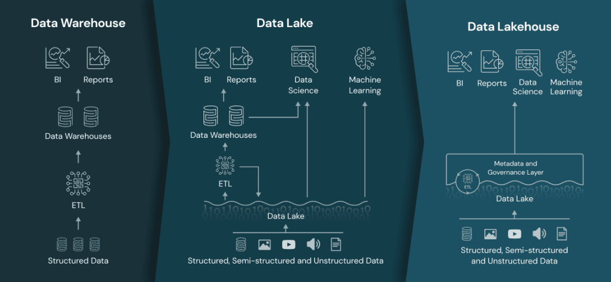
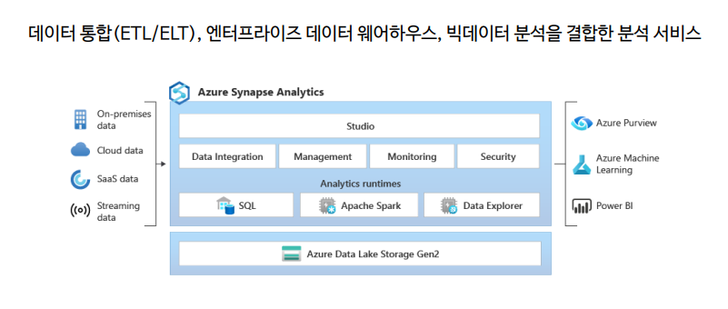

## 마이크로소프트 빅데이터 분석 체험 교육

날짜 : 2022_12_08
장소 : 위워크 삼성 2호점
시간 : 오후 1시 30분 ~ 오후 5시 30분 까지

---
강사님 : 권태돈
이커머스 기업 데이터 팀장
이메일 : tdon@naver.com

## 빅데이터 통합 데이터 플랫폼

- ETL/ELT를 위한 데이터 파이프라인
- 서버리스/전용서버 데이터 웨어하우스
- SPARK를 이용한 비정형 데이터 분석

[링크 참조 : ](https://www.databricks.com/blog/2020/01/30/what-is-a-data-Iakehouse.html)
Data Lake의 단점 으로 사용하는 툴과 데이터 형태의 복잡성이 가중화 되었다.

DataLakehouse 의 장점으로 DB기능을 datalake 에 접목시켰다. 트랜잭션, 업데이트 등 메타데이터 를 통한 데이터 관리가능.

Azure Synapse Analytics

- 전용 sql pool 은 사용 하는 것에 대한 과금한다.
  - 서버 1대당 월 100만원 정도 보면 된다.
  - 전용 DB서버를 구축하는 것 과 같다.
  - 한 DB 원자당 1000만건 정도.
  - 페타바이트 의 규모를 처리하기위한 하드웨어 성능.

서버리스 SQL 풀 은 데이터 과금은 없으나 조회에 대한 시간에 대해 과금 적용.

## 빅데이터 처리 분석

- 데이터 엔지니어를 위한 Databricks
- 데이터 분석가를 위한 Databricks

Azure Databricks Lakehouse 플랫폼은 데이터 웨어하우스와 데이터 레이크를 하나의 간단한 플랫폼으로 통합해 모든 데이터, 분석 및 ai 사용 사례를 처리합니다.

## 실시간 데이터 처리

- 실시간 데이터 수집
- 실시간 데이터 처리 및 저장

[](https://mermaid.live/edit#pako:eNpdUl1P4zAQ_CurfWqlwLUlTa8WOgkOdEJqDyTKC8qLSZzEItn1-QNdqPrfz6UNB_hpPDMejXa9xYJLhQI7TWUnTU4AltmPRkdiPN5TANeb1QEArJhqaLTzbPuBE0IXTKNKQiVPnpifx4Nyxya00monvWYaWIBLq712DZiDDsb1RcMt1z3I4Bu2sGHq4TK8yuOr9e3V9erm968h45ZAVZUqvH4h5dz5k_32Q1IJlZI-WOU--C6C5y4WKKCw6kuRB_ffejg_3zwvCrwqGtJ_wlfDvbfSqzrGmVYSaao_6xe2Dp0iD3GA5l3dMLfvQXeKYF_WSKPsQK6V7aQuMcHuiARu92KOvlGdylFEWEr7nGNOu-iLo-L7ngoU3gaVYDBlbHalZW1lh6KSrYuskfTI_OmOYot_UUyX89N0kS1my2w-n07T74sEexSzs9Pl5GyRZdlkNp9kaZruEnx9i5gmqEodd78-fJy49krXuPsHdK602A)