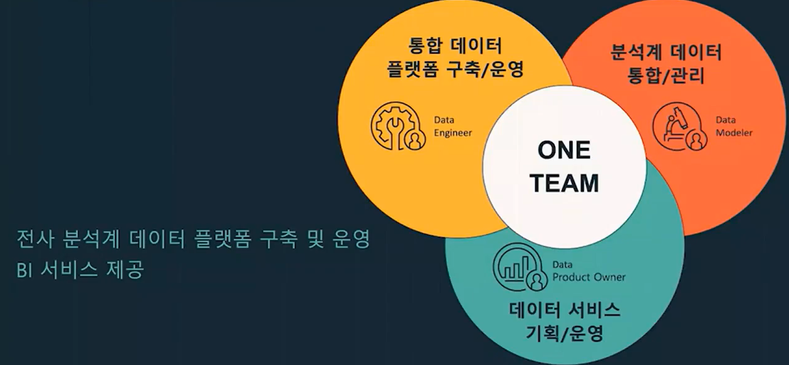
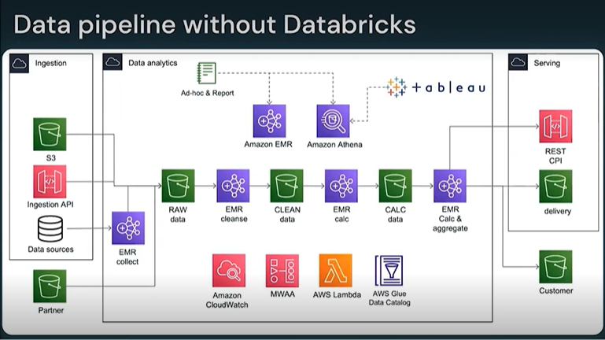
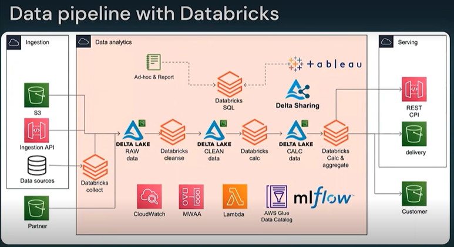
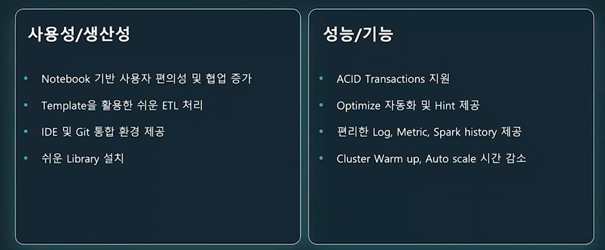

## 아모레 퍼시픽 빅데이터 플랫폼.
전사 분석계 데이터 플랫폼 구축 및 운영. 
BI 서비스 제공

## 데이터브릭스 를 택한 이유
- 데이터 파이프라인 복잡도 증가
- 이분화된 플랫폼의 학습 비용
- 데이터 추가/변경 제약 및 재처리 비용
- 데이터 사일로 현상

pipeline_flow
### 이전의 to_be 파이프라인 흐름도

### 적용된 이전의 파이프라인 흐름도

### Databricks API 를 활용한 workflow 구성

- Airflow custom operator
    - 에어플로우를 사용해 데이터브릭스의 기능을 주기적으로 사용할 수 있도록 커스텀화.
- Configure cluster
  - Auto start-up for All-purpose Compute
  - Auto scaling cluster/storage

### 소스코드 통합.
- ETL 스크립트 통합
  - 단일 Notebook 활용
  - 다양한 언어의 실행환경 통합

### Notebook 기반 쉬운 데이터 처리.
- Template Notebook
  - ETL 파이프라인 단순화
- 사용자 편의성
  - ETL 작업단계 축소
  - 개발/운영 환경 통합

### Delta Lake 사용.
- ACID 트랜잭션
  - 쉬운 데이터 변경
  - 과거 데이터 버전 관리
- Optimizations
  - Auto-optimization
  - Query Hint
- Table ACLs/RBAC

## 정리

