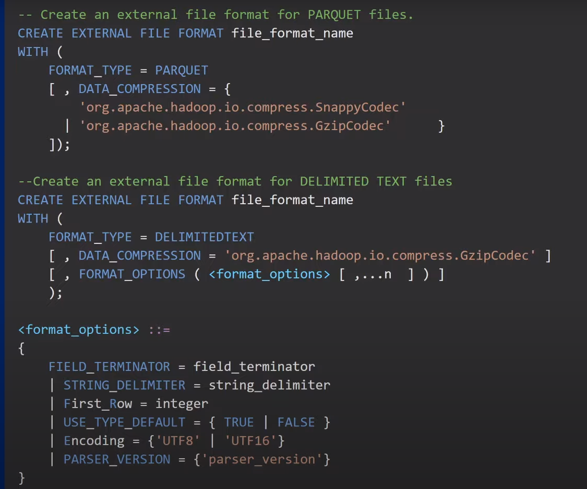

# SynapseAnalytics

링크 : https://www.youtube.com/@WafaStudies/playlists\
저자 : WafaStudies\
국가 : 인도\
키워드 : Azure, Pyspark, Databricks 등

1. Introduction to Azure Synapse Analytics
   * 시냅스에 대한 전반적인 설명, 아키텍처 등
2. Create Azure Synapse Analytics Workspace
   * 애져 시냅스 분석 워크스페이스 생성
3. Basic Concepts in Azure Synapse Analytics
   * 애져 시냅스 분석의 기본 구성 및 GUI 설명
4. Analyze data with a server less SQL pool
   * csv 의 소스테이터 추출 및 SQL Pool 에서의 사용
     * 전반적으로 일반적인 ANSI 표준의 SQL과 유사하다.
     * csv 등 데이터 포맷을 지정하여 소스데이터를 추출 한다.
     * 가져온 소스데이터 를 타겟으로 프레임화 시킬수 가 있다
5. Analyze data with dedicated SQL Pool in Azure Synapse Analytics
   * parquet 파일 추출 [파케이 포멧 설명 링크](https://pearlluck.tistory.com/561)
   * ddl 정의 및 테이블 생성후 클라우드에 저장된 parquet 포멧의 파일 링크를 from절에서 링크를 부여 한후 데이터를 카피 한다.
   * 
   * 스크립트에서 select 날리기
6. Analyze data with Server less Spark Pool in Azure Synapse Analytics
   * spark pool(스파크 워커) 생성
   * 애져 시냅스에서 스파크 클러스터를 생성 할 수 있음.(스펙 조정 가능)
   * sql pool 또는 spark pool 에 대한 개념은 서버 환경 및 스펙 구축 환경이라고 볼 수 있음.
   * spark pool 생성 후 spark.read.load(path=,format=,schema= ${optional} ) 으로 소스데이터 추출.
   * spark 내에서 트랜젝션 하고 집계 쿼리를 통해 나온 결과를 saveAsTable 옵션을 통해 spark내 저장 가능.
   * Transfer 작업 후 로드 전 단계 로 볼 수 있음.
7. Analyze data in Storage Account in Azure Synapse Analytics
   * 변환한 데이터를 적재(Load) 하는 방법에 대해 설명
   * 
     * df.repartition(1) 의 경우 결과값의 한 row가 하나씩 파일로 만들어 지는 것이 아닌 모든 데이터 결과값이 한 개의 파일로 적재 될 수 있도록 옵션을 설정 해 주어야함.
8. Integrate Pipelines in Azure Synapse Analytics
   * 로드된 데이터를 SQL스크립트로 데이터를 보는 방법과, 쥬피터 노트북과 같은 환경의 애져기반 노트북에서 같은 데이터를 보는 방법을 설명.
   * 파이프 라인을 설계하는 것을 설명함.
   * 에어플로우 에서의 DAG를 활용한 파이프라인의 구축과 비슷함.
   * 모니터링도 가능하고 진행중인 과정도 웹환경에서 GUI가 구현되어 있음.
   * 트리거 사용 방법 설명
9. Monitor your Azure Synapse Analytics Workspace
   * 파이프라인과 트리거, SQL의 활동 및 스파크활동 모니터
   * 스파크의 잡형태 세션 정보 등등을 애져 시냅스 기반에서 확인이 가능함.
10. Add an Administrator to your Azure Synapse Workspace

    * 담당자 권한 설정.
    * SQL인 경우

    ```
     CREATE USER [abc@outlook.com] FROM EXTERNAL PROVIDER;
     EXEC sp_addrolememember 'db owner', 'abc@outlook.com/
    ```
11. Azure Synapse SQL Architecture
    * Synapse SQL 의 종류 2가지
      * Serverless SQL Pool
      * Dedicated SQL Pool
    * 서버리스 SQL Pool (Serverless SQL Pool) -> query data, blob storage 등
      * Dedicated SQL Pool -> DB
12. Distributions(Hash, Round Robbin & Replicate) in Azure Synapse Analytics
    * 해시 분산 테이블 (Hash Distributed Tables)
      * [참조링크 : 해시넷](http://wiki.hash.kr/index.php/%EB%B6%84%EC%82%B0%ED%95%B4%EC%8B%9C%ED%85%8C%EC%9D%B4%EB%B8%94)
      * [참조링크 : 블로그](https://ddongwon.tistory.com/76)
    * 라운드 로빈 분산 테이블 (Round Robbin Distributed Tables)
      * 라운드 로빈 테이블은 적재를 위한 가장 심플한 방법이다.
      * 테이블 생성과 데이터 전달의 퍼포먼스가 빠르다.
      * 그러나 쿼리 퍼포먼스는 해시 분산 테이블 더 나을 수 있다.
    * 복제 테이블 (Replicated Tables)
      * 테이블내 데이터를 여러 노드에 복제 한다.
      * 적은 테이블 갯수를에 쿼리 퍼포먼스가 가장 빠르다. 왜냐하면 같은 내용을 분산처리로 조회하기떄문.
13. Server less SQL Pool Overview in Azure Synapse Analytics
    * 이기종의 성격을 가진 데이터 포멧이나 DB 에 폭넓은 쿼리를 지원한다.
    * T-SQL 문법도 사용가능하다.
    * Serverless SQL pool 은 T-SQL 을 지원한다. 그러나 다음 항목은 지원하지 않는다.
      * Tables
      * Triggers
      * Materialized Views
      * DDL statements view 나 보안과 관련된 하나이상 - DML statements
14. Create External Data source in Azure Synapse Analytics
    * 
    * 
    * External Data source
    * Master Key
    * Credential(Database coped credential)
      * 외부 소스로 접근하기 위한 승인 정보
15. Create External File Format in Azure Synapse Analytics
    * External File 하는 경우 다른 포맷으로 테이블 데이터를 변환 할 수 있음.
    * 예) table 데이터 -> csv
    * 
16. CETAS with Synapse SQL in Azure Synapse Analytics
    * CETAS(Create External Table as SELECT)
    * 문법은 다음과 같다.
    * 
17. CTAS with Synapse SQL in Azure Synapse Analytics
    * CTAS(Create Table as SELECT)
    * SELECT INTO vs CTAS 차이점 설명
      * CTAS 는 커스터마이징을 상세 하게 할 수 있다.
      * SELECT INTO 는 분산 방법 의 타입을 지정 할 수가 없다.
      * SELECT INTO 는 DEFUALT 로 분산처리 방식이 라운드로빈으로 설정된다.
      * CTAS는 분산처리와 테이블 구조 타입을 지정할 수있다.
18. External Tables with Synapse SQL in Azure Synapse Analytics
    * 
19. Create and query external tables from a file in ADLS in Azure Synapse Analytics
    * 시냅스 sql 로 external table 을 만들 수있다. 그러나 오직 **Parquet** file의 형태만 지원한다.
20. Types of External Tables(Hadoop & Native) in Synapse SQL in Azure Synapse Analytics
    * 하둡과 네이티브 의 차이가있다.
    * 하둡방식
      * 자바 기반. 조회속도에 네이티브에 비해 더 걸린다.
    * 네이티브 방식
      * C 기반. 처리속도가 빠르다.
    * 하둡과 네이티브 방식의 차이와 지원 여부
      * 
21. Administrative accounts in Synapse SQL in Azure Synapse Analytics
    * Azure Synapse Analytics 의 워크스페이스 내에서 sql endpoint 계정 설정 url 설명
      * SQL Active Directory admin
      * Dedicated SQL endpoint
      * Serverless SQL endpoint
      * Development endpoint
