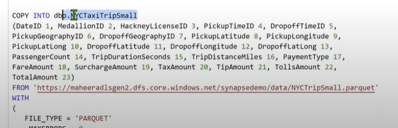
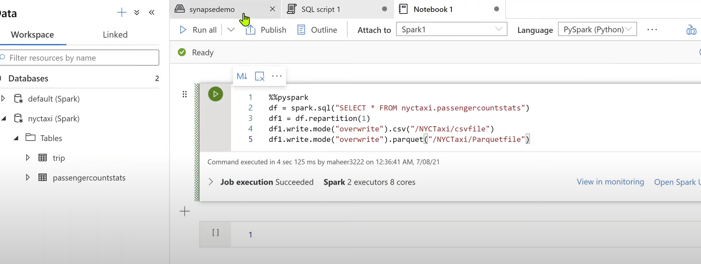

## 강의 요약.

링크 : https://www.youtube.com/@WafaStudies/playlists  
저자 : WafaStudies  
국가 : 인도  
키워드 : Azure, Pyspark, Databricks 등  

1. Introduction to Azure Synapse Analytics
    - 시냅스에 대한 전반적인 설명, 아키텍처 등
2. Create Azure Synapse Analytics Workspace
    - 애져 시냅스 분석 워크스페이스 생성
3. Basic Concepts in Azure Synapse Analytics
    - 애져 시냅스 분석의 기본 구성 및 GUI 설명
4. Analyze data with a server less SQL pool
    - csv 의 소스테이터 추출 및 SQL Pool 에서의 사용
      - 전반적으로 일반적인 ANSI 표준의 SQL과 유사하다.
      - csv 등 데이터 포맷을 지정하여 소스데이터를 추출 한다. 
      - 가져온 소스데이터 를 타겟으로 프레임화 시킬수 가 있다
5. Analyze data with dedicated SQL Pool in Azure Synapse Analytics
    - parquet 파일 추출 [파케이 포멧 설명 링크](https://pearlluck.tistory.com/561)
    - ddl 정의 및 테이블 생성후 클라우드에 저장된 parquet 포멧의 파일 링크를 from절에서 링크를 부여 한후 데이터를 카피 한다.
    - 
    - 스크립트에서 select 날리기
6. Analyze data with Server less Spark Pool in Azure Synapse Analytics
    - spark pool(스파크 워커) 생성
    - 애져 시냅스에서 스파크 클러스터를 생성 할 수 있음.(스펙 조정 가능)
    - sql pool 또는 spark pool 에 대한 개념은 서버 환경 및 스펙 구축 환경이라고 볼 수 있음.
    - spark pool 생성 후 spark.read.load(path=,format=,schema= ${optional} ) 으로 소스데이터 추출.
    - spark 내에서 트랜젝션 하고 집계 쿼리를 통해 나온 결과를 saveAsTable 옵션을 통해 spark내 저장 가능.
    - Transfer 작업 후 로드 전 단계 로 볼 수 있음.
7. Analyze data in Storage Account in Azure Synapse Analytics
    - 변환한 데이터를 적재(Load) 하는 방법에 대해 설명
    - 
      - df.repartition(1) 의 경우 결과값의 한 row가 하나씩 파일로 만들어 지는 것이 아닌 모든 데이터 결과값이 한 개의 파일로 적재 될 수 있도록 옵션을 설정 해 주어야함.
    
8. Integrate Pipelines in Azure Synapse Analytics
    
