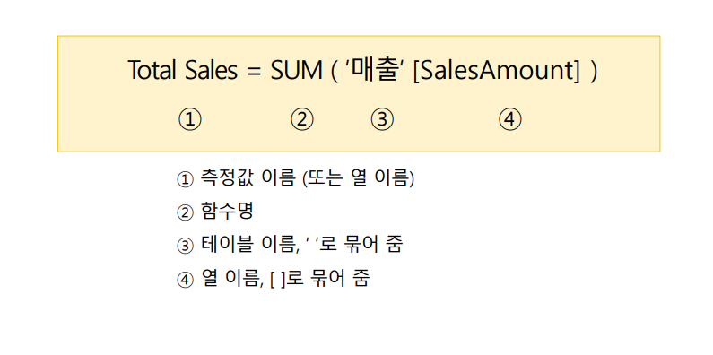

# DAX 구문

1. 측정값 이름(또는 열 이름)
    - 측정값은 데이터 카테고리에서 볼 수 없다.
    - 보고서에서만 시각화를 사용하여 결과치를 볼 수있다.
2. 함수명, 엑셀이나 파워bi에서 지원하는 함수를 사용하여 쓸 수있다.
3. 테이블 이름은 싱글 쿼테이션 으로 묶어 표현한다.
4. 열이름은 대괄호를 사용하여 표현한다.

## 측정값 설명
- 측정값은 수식에 의한 계싼된 결과 값을 반환합니다.
- 사긱화에 추가되는 필드, 슬라이서, 필터 등 보고서 조작에 따라 동적으로 변하는 값 입니다.
- 시각적 개체의 값에 사용, 다른 수식에서 인수로 사용합니다.
  - 예) 매출금액의 합계, 총 매출 금액의 백분율 표현 등

## 테이블 수식의 결과로 테이블 반환합니다.
 예) CALENDAR, FILTER, TOPN, SUMMARIZE
 
##