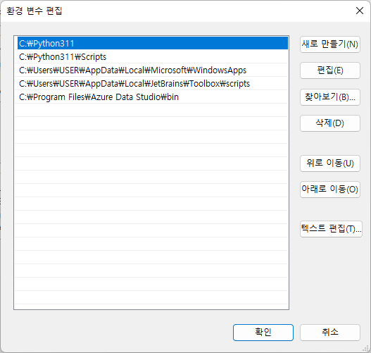

## 파이썬 설치


### 파이썬 다운로드

[아나콘다 설치경로](https://www.anaconda.com/products/distribution)
[파이썬 공식 홈페이지](https://www.python.org/downloads/)  

가급적이면 아나콘다로 설치하여 환경변수를 설정한다.

- C:\dev\env\Anaconda3\Lib\site-packages
- C:\dev\env\Anaconda3\Scripts
- C:\dev\env\Anaconda3\Lib\site-packages\pythonwin
- C:\dev\env\Anaconda3\Lib\site-packages\lpython\extensions
- C:\dev\env\Anaconda3\Lib\site-packages\win32
- C:\dev\env\Anaconda3\Library\usr\bin
- C:\dev\env\Anaconda3\Library\bin


버전은 스파크 3.2.3 기준 3.6이거나 3.6 이상 지원.

### 환경변수 설정
 
 - User Path 경로 설정
 - System Path 경로 설정


**User Path 경로 설정**  

python installed directory & script 추가

**System Path 경로 설정**  

python installed directory & script  

- 예제 사진)
    -  
    - 

### pip update

pip 업데이트 최신화 적용

```bash
		python.exe -m pip install --upgrade pip
```


### library

파이썬 라이브 러리 설치 

```bash
		pip install pandas
```
