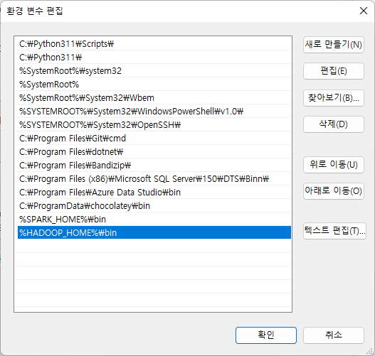

## 준비목록

- JAVA
- Python
- PySpark
- Winutils

## 자바 다운로드

[java.com/en/download/](https://www.java.com/en/download/)

1. 다운로드
2. 설치경로 :  C:\\dev\\env\\java

## 스파크 다운로드

[spark.apache.org](https://spark.apache.org/downloads.html)

1. 다운로드 경로 : C:/dev/env
2. 압축해제 및 bin 폴더 최종 경로 확인
	C:\\dev\\env\\spark-3.2.3-bin-hadoop3.2\\bin
	
## winutils 다운로드

[github.com/cdarlint/winutils](https://github.com/cdarlint/winutils)

1. 다운로드
2. 압축파일을 하둡내 hadoop\\bin 파일을 아래경로로 이동
3. 폴더 최종 경로 확인
4. C:\\dev\\env\\spark-3.2.3-bin-hadoop3.2\\hadoop\\bin
 
### 환경변수 설정

- 환경변수 설정 - 유저 
- 환경변수 설정 - 시스템 


**환경변수 설정 - 유저**

- SPARK_HOME
- HADOOP_HOME
- PYSPARK_PYTHON


**환경변수 설정 - 시스템**




## pyspark 실행

```bash
pyspark
```


현재 스파크 클러스터에 주피터에서 pyspark 라이브러리로 편하게 임포트 시키기 위해 환경변수 2가지를 추가해준다.

- 환경변수 설정 - 유저
	- PYSPARK_DRIVER_PYTHON
	- PYSPARK_DRIVER_PYTHON_OPTS

**PYSPARK_DRIVER_PYTHON** 추가


**PYSPARK_DRIVER_PYTHON_OPTS** 추가


### 에러 발생시

- PYSPARK_DRIVER_PYTHON jupyter가 먹지 않는 경우
	- 주피터가 설치되어 있는 파이썬의 경로를 확인 해야한다.
	- 대부분 아래의 경로 와 같다.
		- C:\\Users\\USER\\AppData\\Roaming\\Python\\{파이썬버전명}\\Scripts
	- 환경변수의 폴더 설정을 위의 경로로 대체한다.
	- 그리고 재실행

pyspark 입력시 환경변수가 제대로 입력되지 않은 경우

[파이스파크 마스터 모니터링 : localhost:4040](https://localhost:4040)


### 참고링크
[How to setup Pyspark on window](https://blog.datamics.com/how-to-install-pyspark-on-windows-faf7ac293ecf)