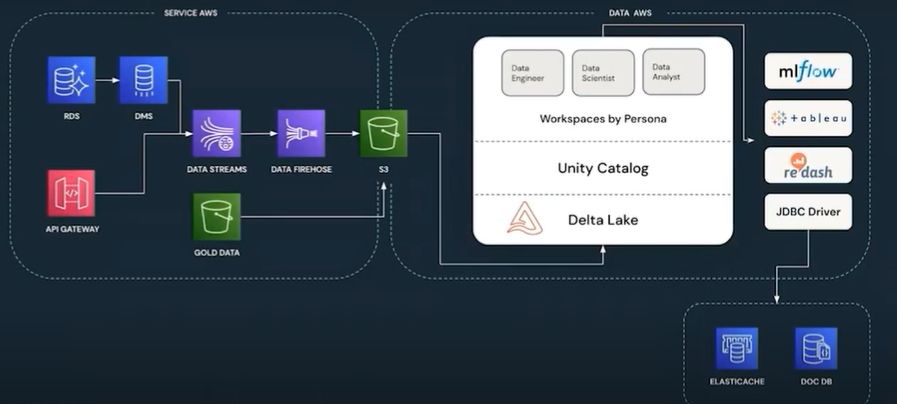
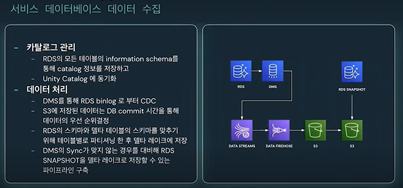
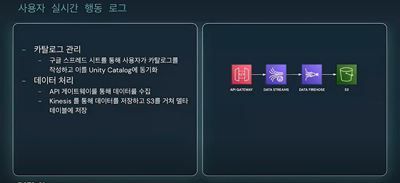
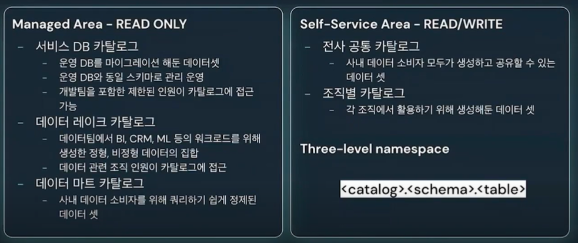
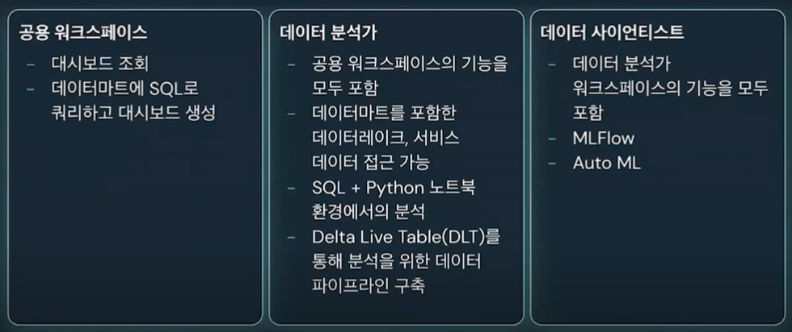

## 데이터 브릭스 도입 배경
1. One Data Platform, Multi Service
  - 무신사, 무신사 글로벌, 29CM, 레이지나잇. 솔드아웃
  - 여러 서비스의 독립된 클라우드 환경의 데이터를 하나의 폴랫폼으로 통합 필요
2. 데이터 활용 증가
  - 프로덕트. 마케팅. 영업- 전사
3. 페르소나에 따른 데이터 환경 제공 필요성
  - 분석. 머신러닝, 대시보드 뷰어 등 각 페르소나에 맞는 데이터 카탈로그와 개발/분석 환경 제공 필요
4. 서비스 클라우드와 데이터 클라우드의 분리 필요성
  - 하나의 글라우드에 서비스와 데이터를 모두 운영함으로써 정책 충돌 발생

## 데이터브릭스 선택 이유.
1. AWS와 통합
  - 서비스 AWS와 데이터 데이터브릭스의 Cross Account 설정을 통해서 기존 데이터 환경을 빠르게 마이그레이션 함.
2. 오픈소스
   - 플랫폼의 개방성.
   - 아파치 스파크를 이용했던 기존 데이터 처리를 마이그레이션 하기 수월.
3. 거버넌스
   - 중앙 관리가 가능한 거버넌스를 Unity Catalog 를 통해 제공하였다.
4. ACID
5. 데이터브릭스의 아키텍처
  - Data Plane + Control Plane 으로 나뉘어진 아키텍처에 자사 cloud 환경에 모든 데이터가 저장되는 구조.

## 데이터브릭스 도입 과정.
검토부터 운영 환경 구축까지의 절차는 다음과 같이 진행.
- PoC 항목 작성
  - 거버넌스, 데이터분석, 머신러닝, 레이크하우스, 워크플로우 범위에서 약 44개를 검토함.
- PoC 진행
- 운영 환경 구축
  - VPC,SSO 관련 설정
  - 사용자, 사용자 그룹, 워크스페이스 등을 포함한 조직내 거버넌스 체계를 구축.
  - 데이터 마이그레이션

### Proof of Concept 항목
페르소나에 따른 기능 검토.
- 데이터 거버넌스
  - SSO 연동, 데이터 접근 구너한, cOMPUTE 사이즈 제어, 데이터 공유, 카타로그 서비스
- 분석 환경
  - SQL, pYTHON 분석 환경, 대시보드
- 머신러닝
  - 모델관리, AutoML
- 워크플로우관리
- 데이터 웨어하우징
  - 데이터 타입에 따른 델타레이크(delta lake) 에 데이터 통합

## 데이터 수집
데이터 수집의 방법과 아케틱처 설명.

### 서비스 데이터베이스 데이터 수집
  관계형데이터 베이스의 변경분을 지속적으로 델타레이크에 마이그레이션 할 수 있는수준이 됨.
  
  
### 사용자 실시간 행동 로그
카탈로그 관리하는것이 인상적이다. 구글 스프레드 시트를 Unity Catalog 에 동기화 하는것. 유연하게 거버넌스를 관리 할 수 있다.

- 카탈로그 관리 측면
- 데이터 처리 측면

### AWS에서 운영하던 기존 GOLD DATA
- 카탈로그 관리
- 데이터 처리
  - parquet(파키아) 형태로 데이터를 그대로 통으로 이전.

## Unity Catalog
- ANSI SQL로 권한 관리가 가능 하다.
- Lineage
- 데이터 검색
- 테이블 자동 튜닝

### 데이터셋 관리
데이터셋에 따른 카탈로그를 부서 및 역할군 으로 나누어 관리함.

### 워크스페이스 관리
데이터 활용 범위에 따른 워크스페이스 활용
 

## 정리
- 접근성
  - SSO
  - 데이터 공유
    - 누구나 데이터를 생성하고 공유할 수있음.
- 거버넌스 측면
  - Unity Catalog
    - 컬럼 단위까지 접근제어가 가능하다.
  - 조직별 리소스 접근 제어
    - GPU Machine을 포함한 클러스터 사이즈 생성관리.
    - 페르소나에 따른 리소스 관리
- 클라우드 통합
  - 기존 클라우드와 통합 가능한 데이터 플랫폼 구축.