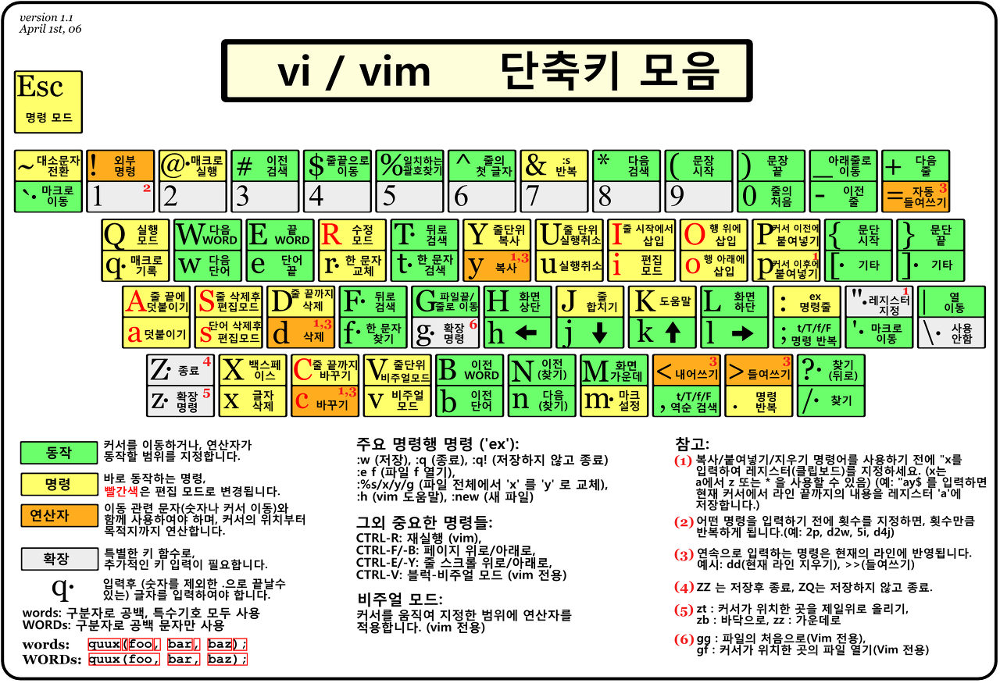
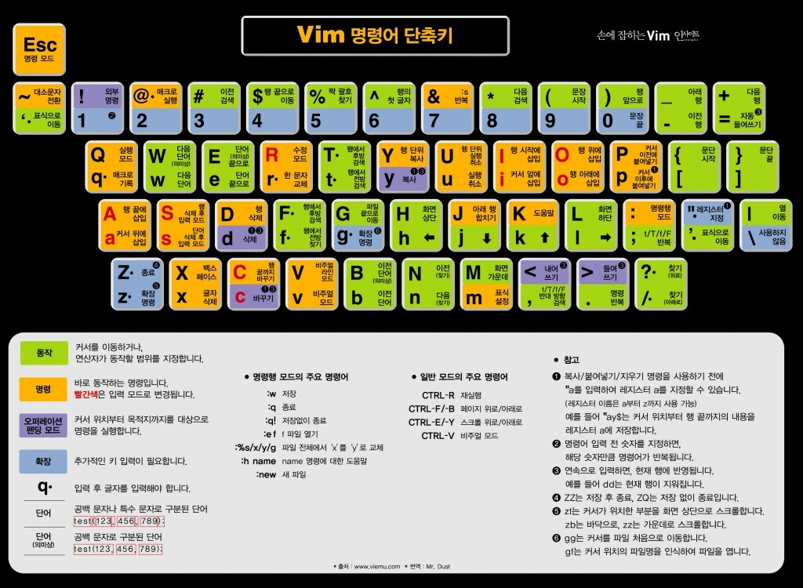

## vi 의 사용.

## vi / vim 편집기 명령어 총정리

### vi의 시작 명령어
| 명령어                     | 설명                          | 예제                  |
|:------------------------|:----------------------------|:--------------------|
| vi {파일명}                | 파일 열기, 작성하기                 | vi test.txt         |
| vi + {행번호}{파일명}         | 파일을 열고, 입력한 행으로 커서를 이동시킵니다. | vi -200 test.txt    |
| vi + /"{검색할 문자열}" {파일명} | "문자열"의 처음발생한 단어부터 엽니다.      | vi -/"abc" test.txt |
| vi -r {파일명}             | 손상된 파일을 회복 합니다.             | vi -r test.txt      |
| view {파일명}              | 읽기전용을 파일을 엽니다.              | view test.txt       |

### vi의 커서 이동                               

| 커서          | 설명                     |
|-------------|------------------------|
| h (←)       | 왼쪽으로 커서 이동             |
| j (↓)	      | 아래로 커서 이동              |
| k (↑)	      | 위로 커서 이동               |
| l (→)	      | 오른쪽으로 커서 이동            |
| e	          | 오른쪽 한 단어의 끝 부분으로 커서 이동 |
| w	          | 오른쪽 한 단어의 앞 부분으로 커서 이동 |
| b	          | 왼쪽 한 단어의 앞 부분으로 커서 이동  |
| Enter	      | 한 행 아래로 커서 이동          |
| Back space	 | 한 문자 왼쪽으로 커서 이동        |
| Space Bar	  | 한 문자 오른쪽으로 커서 이동       |
| ^	          | 행의 맨 왼쪽으로 커서 이동        |
| $	          | 행의 맨 오른쪽으로 커서 이동       |
| H	          | 화면의 맨 위로 이동            |
| M	          | 화면의 중간으로 이동            |
| L	          | 화면의 맨 아래로 이동           |
| 숫자G	        | ‘숫자’ 만큼 지정한 줄로 커서 이동   |
| Ctrl + i	   | 한 화면 위로 이동             |
| Ctrl + b	   | 한 화면 아래로 이동            |
| Ctrl + d	   | 반 화면 위로 이동             |
| Ctrl + u	   | 반 화면 아래로 이동            |
| Ctrl + e	   | 한 줄씩 위로 이동             |
| Ctrl + y	   | 한 줄씩 아래로 이동            |

	        
### 문자나 행을 삽입 하는 명령어.

|  커서  |        설명        |
|:----:|:----------------:|
| a	커서 |    오른쪽에 문자 삽입    |
| A	커서 | 오른쪽, 행의 끝에 문자 삽입 |
| i	커서 |    왼쪽에 문자 삽입     |
| I	커서 | 왼쪽, 행의 처음에 문자 삽입 |
| o	커서 |     아래에 행 삽입     |
| O	커서 |     위에 행 삽입      |
| ESC  |       	종료        |

### 텍스트 변경 명령어
|   명령어    |           설명            |
|:--------:|:-----------------------:|
|   cw	    |          단어 변경          |
|   cc	    |          행 변경           |
|    C	    |      커서 오른쪽의 행 변경       |
|    s	    |     커서가 위치한 문자열 대체      |
|    S	    |   커서가 위치한 라인의 문자열 대체    |
|    r	    |   커서 위치 문자를 다른 문자로 대체   |
| r-Enter	 |          행 분리           |
|    J	    |      현재 행과 아래 행 결합      |
|   xp	    |   커서 위치 문자와 오른쪽 문자 교환   |
|    ~	    |     문자형(대, 소문자) 변경      |
|    u	    |        이전 명령 취소         |
|    U	    | 행 변경 사항 취소, 이전의 최종 행 취소 |
|    .	    |       이전 최종 명령 반복       |

### 텍스트를 삭제하는 명령어
|   명령어   |          	설명           |
|:-------:|:----------------------:|
|   x	    |      커서가 있는 문자 삭제      |
|   nx	   | 커서가 있는 위치부터 n개의 문자를 삭제 |
|   dw	   |   현재 커서에 있는 한 단어 삭제    |
|   dd	   |      커서가 있는 라인 삭제      |
|  ndd	   | 커서가 있는 라인부터 n개의 라인 삭제  |
|   db	   |  커서의 위치에서 거꾸로 한 단어 삭제  |
|   D	    |      커서 오른쪽 행 삭제       |
| :5,10d	 |      5~10번째 행 삭제       |

### 복사 및 이동으로써 의 명령어.
|    명령어     |            	설명             |             
|:----------:|:--------------------------:|
|    yy	     |        커서가 위치한 줄 복사        |
|     Y	     |        행 yank 또는 복사        |
|    yh	     |        커서의 왼쪽 문자 복사        |
|    yl	     |       커서에 위치한 문자 복사        |
|    yi	     |    커서가 위치한 줄과 그 아랫줄 복사     |
|    yk	     |     커서가 위치한 줄과 그 윗줄 복사     |
|     p	     | yank 되거나 삭제된 행 현재 행 위로 삽입  |
|     P	     | yank 되거나 삭제된 행 현재 행 아래에 삽입 |
| :1,2 co 3	 |      1~2행을 3행 다음으로 복사      |
| :4,5 m 6	  |       4~5행을 6행 위로 이동       |

### 탐색 및 대체 명령어
|                  명령어                  |                  	설명                  |             
|:-------------------------------------:|:-------------------------------------:|
|              /{검색할 문자열}	              |          오른쪽 아래 방향으로 문자열 검색           |
|              ?{검색할 문자열}	              |           왼쪽 위 방향으로 문자열 검색            |
|                  n	                   |            문자열의 다음으로 계속 검색            |
|                  N	                   |            문자열의 이전으로 계속 검색            |
| :g/search-string/s/	각 발생 탐색 후 확인하고 대체 |
|            :s/string/rep	             |          현재 행의 str을 rep로 대체           |
|          :1,.s/string/rep/	           |        1부터 현재 행의 str을 rep로 대체         |
|           :%s/string/rep/g            |         	파일 전체 str을 rep로 전부대체         |
|              :.$/aaa/bbb              | 	커서의 위치로부터 파일의 끝까지 있는 모든 aaa를 bbb로 대체 |

### 단축키 이미지

